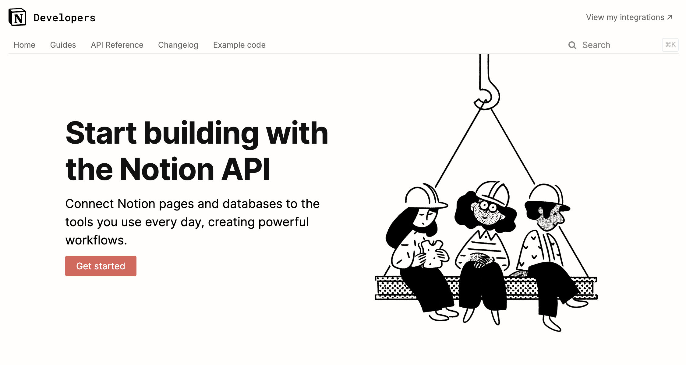

# canvas2notion

## Overview
This repository contains a jupyter notebook you can run to upload all your [Canvas](https://www.instructure.com/canvas) assignments from a class into a [Notion](https://www.notion.so/product) database using both canvas and Notion's RESTful api documentation.

[Canvas LMS API Documentation)(https://canvas.instructure.com/doc/api/)
[Notion API Documentation](https://developers.notion.com/)

## Step 1
Create a file in the same directory called secretStuff.py. This is where you'll add in your personal information like your Notion token, your Canvas notion, and your Notion database ID.

## Step 2
Create the following variables in secretStuff.py and fill them by following the instructions for each.

`notion_token` 
In order to interact with the Notion API we have to request a token from them, like a password.

### Step 2.1

IN CONSTRUCTION
